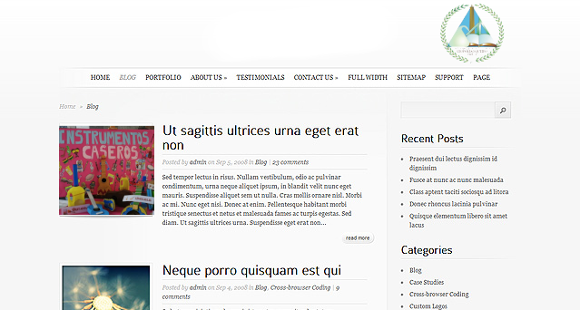

# Examen HTML

Nos han proporcionado un boceto para hacer la plantilla de estilos de la página web del instituto I.E.S. Leopoldo Queipo.

Elabora el documento HTML y la plantilla CSS para distribuir el contenido.

No tengas en cuenta:

- Tipo de letra, color, tamaño, etc
- Fondo, color, tamaño, etc
- Estilos visuales de los enlaces
- Imagen de la lupa en el formulario de búsqueda. Usa un botón.

Qué debo tener en cuenta:

- Distribución de los contenidos
- Enlaces a otras páginas 
- Formulario de búsqueda
- Uso de listas no ordenadas
- Lo que está entre dos líneas, se marca con un cuadrado.

Suerte.